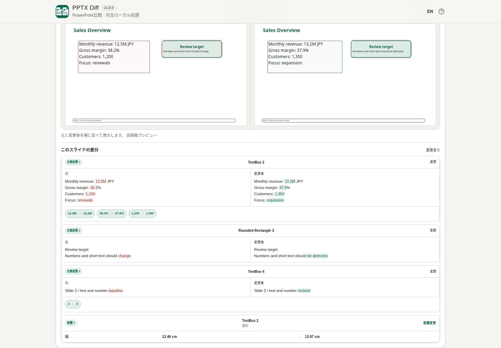

# PPTX Diff

[](https://github.com/ttomohisa/htmlapps-pptx-diff/actions/workflows/deploy-pages.yml)
[](LICENSE)
[](https://ttomohisa.github.io/htmlapps-pptx-diff/)

[English README](README.md)

PPTX Diff は、2つの PowerPoint（`.pptx`）ファイルを外部サーバーへアップロードせずに比較できる、完全ローカル処理の単一HTMLアプリです。スライドの追加・削除・移動があっても対応するスライドを探し、内容の差分と高精細な見た目比較をまとめて確認できます。

## 🚀 デモ

### [GitHub PagesでPPTX Diffを開く](https://ttomohisa.github.io/htmlapps-pptx-diff/)

GitHub Pagesから最初のHTMLを読み込んだ後、PPTXの解析、スライド対応付け、差分検出、高精細プレビュー、レポート生成はブラウザ内で処理します。選択したPowerPointファイルをアプリがサーバーへアップロードすることはありません。

[](https://ttomohisa.github.io/htmlapps-pptx-diff/)

## 主な機能

- **スライド番号だけに頼らず対応付け** — スライドの追加・削除・移動を考慮して、元ファイルと変更後ファイルの対応スライドを探します。
- **内容の変更を分類して確認** — 文章、数値、オブジェクト、画像、配置、書式、発表者ノートの差分をスライド単位で確認できます。
- **見た目でも確認** — 高精細プレビューを使い、横並び・重ね合わせ・分割・点滅で変更前後を比較できます。
- **グラフを含むスライドもプレビュー** — 埋め込みPPTXレンダラーをDOMへ接続してから初期化することで、対応グラフをVisual Compareで表示します。
- **大きな比較結果を絞り込み** — 差分カテゴリ別フィルターと「変更されたスライドのみ」を組み合わせて確認できます。
- **比較結果をHTMLで保存** — 高精細プレビュー付きの折りたたみ可能なレポートを保存できます。対応ブラウザではgzip圧縮した自己展開HTMLになります。
- **完全ローカル処理の単一HTML** — PPTXレンダラーを内包し、実行時の外部通信をCSPで禁止。日本語 / 英語UIに対応します。

## すぐに使う

### Webで使う

[デモを開く](https://ttomohisa.github.io/htmlapps-pptx-diff/)だけで利用できます。インストールやアカウント登録は不要です。

### 単一HTMLをダウンロードして使う

1. Releaseまたはビルド成果物から `dist/index.html` または `dist/index.self-extract.html` をダウンロードします。
2. 現行ブラウザでファイルを開きます。
3. 元ファイルと変更後ファイルの `.pptx` を選択して比較します。

`index.html` は読みやすい通常の単一HTMLです。`index.self-extract.html` は同じアプリをgzip圧縮して保持し、開いたときに端末内で展開します。

### ローカルでビルドする

1. Windowsでこのリポジトリをダウンロードまたはクローンします。
2. `build-standalone.bat` をダブルクリックするか、PowerShellから `./build-standalone.ps1` を実行します。
3. 初回だけ `dependencies.lock.json` に固定された依存パッケージを取得します。
4. 生成された `dist/index.html` または `dist/index.self-extract.html` を利用します。

通常のビルドにはWindows PowerShellと `tar.exe` を使います。Node.js、Python、ローカルWebサーバーは不要です。

## 使い方

1. **元ファイル** のPowerPointを追加します。
2. **変更後ファイル** のPowerPointを追加します。
3. **スライドを比較** を押します。
4. 対応付け結果を確認します。スライドは「変更なし / 変更あり / 追加 / 削除 / 移動 / 要確認」などの状態で表示されます。
5. **変更内容を見る** を開き、文章・数値・オブジェクト・画像・配置・書式・発表者ノートの差分を確認します。
6. スライド行を選択して **見た目で比較** を開きます。
7. **横並び / 重ね合わせ / 分割 / 点滅** を切り替えて確認します。差分表示はPPTXプレビューを再レンダリングせずに表示 / 非表示を切り替えられます。
8. カテゴリフィルターや **変更されたスライドのみ** で対象を絞り込みます。
9. 必要なら **比較結果をHTMLで保存** します。レポートには資料の文字・画像・発表者ノートが含まれる可能性があるため、保存前に確認ダイアログを表示します。

### 見た目で比較

差分の判定結果はSemantic Diffを基準にします。高精細レンダラーは、検出した変更が実際のスライド上でどう見えるか確認するために使います。

文章差分については、レンダリング後の単語位置を無理に推定せず、対応するテキストボックス全体を枠で示します。細かい文章・数値の変更箇所は、プレビュー下の変更内容で確認できます。

### HTMLレポート

出力レポートには、比較サマリー、Semantic Diff、発表者ノート差分、高精細スライドプレビューを収録します。各スライドは個別に折りたためます。

元のPPTXバイナリそのものはレポートへ埋め込みませんが、資料から取り出した文字・画像・発表者ノートは含まれる場合があります。共有前に内容を確認してください。

`CompressionStream` が使える環境ではレポートをgzip圧縮した自己展開HTMLとして保存します。開くときは `DecompressionStream` で端末内展開し、外部通信は行いません。

## GitHub Pagesで公開する

このリポジトリには、単一HTMLをビルドして `dist/` をGitHub Pagesへ公開するワークフローが含まれています。

1. リポジトリ名を `htmlapps-pptx-diff` としてGitHubへプッシュします。
2. **Settings → Pages → Build and deployment → Source** で **GitHub Actions** を選択します。
3. `main` へプッシュするか、Actionsから **Deploy standalone app to GitHub Pages** を手動実行します。
4. 成功後、`https://ttomohisa.github.io/htmlapps-pptx-diff/` で利用できます。

公開時は固定済みの依存パッケージから単一HTMLを再生成し、外部ランタイム参照や実行時通信が残っていないことを検査します。

## 開発とビルド

```text
.
├─ src/index.template.html       # 編集するアプリ本体
├─ assets/favicon.svg            # アプリ / レポート共通アイコン
├─ dependencies.json             # 埋め込み依存の定義
├─ dependencies.lock.json        # パッケージ版とtarballハッシュの固定
├─ build-standalone.bat          # Windows用ビルド入口
├─ build-standalone.ps1          # 単一HTML生成処理
├─ scripts/                      # 検証・リリースガード
├─ dist/index.html               # 通常の単一HTML
├─ dist/index.self-extract.html  # gzip自己展開単一HTML
└─ .github/workflows/
   ├─ build-standalone.yml       # Pull Request時のビルド検証
   └─ deploy-pages.yml           # GitHub Pages公開
```

### 依存ライブラリを更新する

`dependencies.json` を変更し、リポジトリ内スクリプトで対応するlock情報を更新してから再ビルドします。ビルド時にはnpm tarballのSHA-256を照合します。

ビルド処理では以下も自動で行います。

- PPTXレンダラーをgzip圧縮して単一HTMLへ内包
- canonicalなSVG faviconをアプリへ埋め込み
- 未置換ビルドプレースホルダーを検査
- CSPと実行時通信禁止を検証
- 依存・サイズ・自己展開manifestを生成
- 通常版と自己展開版の2種類の単一HTMLを生成

### 比較中・保存中にファイルを変更した場合

ファイルの選び直し・入れ替え・再比較・配置許容値の変更は、保存中のレポートを中止します。新しい比較結果から再度保存してください。確認画面からプレビュー生成・圧縮まで、レポートは同じ比較内容と言語を使用します。表示フィルターにかかわらず全スライドを出力する従来の範囲は変わりません。

開発時の `scripts/check-repository.ps1` は Node.js 22 以降を使用して、ソース・ルート配布HTML・読みやすい配布版・自己展開版を検証します。通常のビルドは `pptx-diff.html` も更新します。`-OutputPath` を指定したビルドはルート配布版を変更しません。

## プライバシーと通信防止

PPTX Diffは、アプリHTMLを読み込んだ後の処理を完全ローカルで行う設計です。

生成HTMLには以下が含まれます。

- `connect-src 'none'` を含むContent Security Policy
- HTMLへ埋め込まれた固定版PPTXレンダラー
- 埋め込みモジュールやPPTX内リソース用のローカルBlob URL
- アクセス解析・テレメトリーなし
- 選択したPowerPointを送信するアップロード先なし

GitHub Pages版では最初のHTML配信は発生しますが、選択したPPTX内容をアプリが外部へ送信することはありません。完全オフラインで使う場合は生成済みの単一HTMLを直接開いてください。

## 制限事項

- 対応入力は `.pptx` のみです。旧 `.ppt`、`.pptm`、`.ppsx`、パスワード保護されたPowerPointには対応していません。
- ZIP64形式のPPTX、Stored / DEFLATE以外のZIP圧縮方式には対応していません。
- グラフのデータやスタイルを項目単位で詳細比較する機能はありません。安全に詳細比較できないグラフ変更は「要確認」として表示し、見た目はVisual Compareで確認できます。
- SmartArt、アニメーション、画面切り替え、複雑なグループなどは詳細比較できない場合があります。
- 高精細プレビューは確認用であり、PowerPointそのものと完全に同じ描画を保証するものではありません。複雑な効果は見た目が異なる場合があります。
- スライド数が多い資料、高解像度画像、グラフが多い資料ではブラウザのメモリを多く使用します。
- 出力HTMLには元PPTXバイナリを含めませんが、資料の文字・画像・発表者ノートが含まれる場合があります。
- 圧縮PPTX / レポートの展開にはブラウザの `DecompressionStream` が必要です。レポート圧縮には利用可能な場合 `CompressionStream` を使います。

## 使用ライブラリ

| ライブラリ | バージョン | ライセンス | 用途 |
| --- | ---: | --- | --- |
| @aiden0z/pptx-renderer | 1.2.4 | Apache-2.0 | PPTXの高精細スライド表示、対応グラフの描画 |

PPTX ZIP解析、スライド対応付け、Semantic Diff、フィルター、レポート生成はアプリ側で実装しています。ライセンス詳細と、埋め込みレンダラー読み込み前に適用する限定的な文字色互換補正については [THIRD_PARTY_NOTICES.md](THIRD_PARTY_NOTICES.md) を確認してください。

## リリース状況

**v1.0.0 は正式版です。** v0.9.0の機能範囲を維持したまま、最終回帰、リリース用スクリーンショット・メタデータ、正式版への版数切り替えを完了しています。

## コントリビューション

バグ報告や機能提案はGitHub Issuesからお願いします。開発への参加方法は [CONTRIBUTING.md](CONTRIBUTING.md) を確認してください。

## ライセンス

Copyright © 2026 ttomohisa

このプロジェクトは [MIT License](LICENSE) で公開されています。
