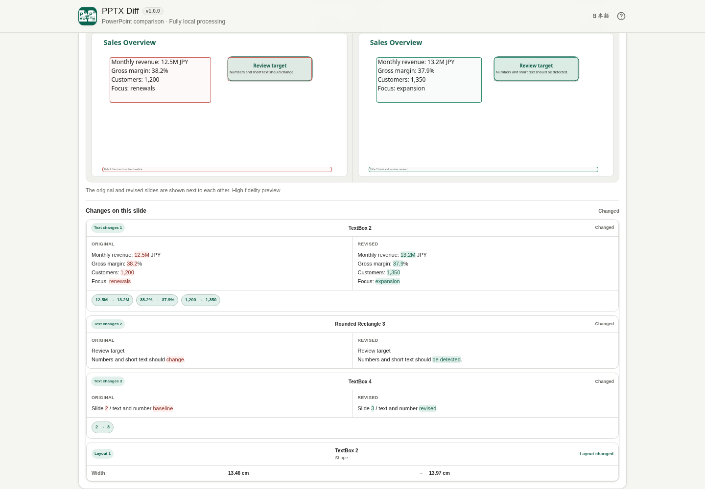

# PPTX Diff

[](https://github.com/ttomohisa/htmlapps-pptx-diff/actions/workflows/deploy-pages.yml)
[](LICENSE)
[](https://ttomohisa.github.io/htmlapps-pptx-diff/)

[日本語版 README](README.ja.md)

PPTX Diff is a privacy-focused, single-HTML app for comparing two PowerPoint (`.pptx`) files without uploading the selected presentations to a server. It matches corresponding slides even when slides were inserted or moved, then combines semantic differences with a high-fidelity visual comparison.

## 🚀 Live demo

### [Open PPTX Diff on GitHub Pages](https://ttomohisa.github.io/htmlapps-pptx-diff/)

GitHub Pages delivers the initial HTML. After it loads, PPTX parsing, slide matching, difference detection, visual rendering, and report generation run locally in your browser. The presentations you select are not uploaded by the app.

[](https://ttomohisa.github.io/htmlapps-pptx-diff/)

## Features

- **Match slides across revisions** — Compare corresponding slides without relying only on slide numbers, including added, removed, and moved slides.
- **Review semantic changes** — Detect text, numbers, objects, images, layout, formatting, and speaker-note changes slide by slide.
- **Confirm changes visually** — Use high-fidelity Side by side, Overlay, Split, and Blink views with optional difference markers.
- **Keep chart previews visible** — Charts rendered by the embedded PPTX renderer are initialized after the slide DOM is mounted, so chart-heavy slides can be reviewed visually.
- **Filter large comparisons** — Show only a change category or only slides that changed without altering the underlying comparison.
- **Save a local comparison report** — Export a collapsible HTML report with high-fidelity slide previews. The report is gzip-compressed into a self-extracting single HTML file when supported.
- **Private, single-HTML operation** — The PPTX renderer is embedded, runtime network access is blocked, and the UI is available in Japanese and English.

## Quick start

### Use the web demo

Just [open the demo](https://ttomohisa.github.io/htmlapps-pptx-diff/). No installation or account is required.

### Use the downloaded single HTML

1. Download `dist/index.html` or `dist/index.self-extract.html` from a release/build artifact.
2. Open the file in a current browser.
3. Select the Original and Revised `.pptx` files and start the comparison.

`index.html` is the readable standalone build. `index.self-extract.html` stores the same app as a gzip-compressed payload and restores it locally when opened.

### Build it locally

1. Download or clone this repository on Windows.
2. Double-click `build-standalone.bat`, or run `./build-standalone.ps1` from PowerShell.
3. The first build downloads the exact dependency version pinned in `dependencies.lock.json`.
4. Use the generated `dist/index.html` or `dist/index.self-extract.html`.

The builder uses Windows PowerShell and `tar.exe`; Node.js, Python, and a local web server are not required for the normal build. The full `scripts/check-repository.ps1` regression check additionally requires Node.js 22 or newer and checks the source, root download, readable build, and restored self-extract build. Default builds also refresh `pptx-diff.html`; custom `-OutputPath` builds leave that root download unchanged.

## Usage

1. Add the **Original** PowerPoint file.
2. Add the **Revised** PowerPoint file.
3. Select **Compare slides**.
4. Review the matched slide list. Slides can be marked Unchanged, Changed, Added, Removed, Moved, or Review.
5. Expand **View changes** to inspect text, number, object, image, layout, formatting, and speaker-note differences.
6. Select a slide row to open **Visual compare**.
7. Switch between **Side by side**, **Overlay**, **Split**, and **Blink**. Difference markers can be hidden without re-rendering the slide.
8. Use the category filters or **Changed slides only** to narrow the result list.
9. Use **Save comparison as HTML** when you need an offline report. The app asks for confirmation because the report can contain presentation text, images, and speaker notes.

### Visual comparison

Use **First / Previous / Next / Last** beside the preview to move through the currently filtered comparison rows. First and Last jump to the visible boundaries, including added and removed slides. Navigation preserves expanded change details and scroll position; the current row is also identified for assistive technology.

Semantic Diff is the source of truth for detected changes. The visual renderer is used to confirm how those changes look on the slide.

For text changes, PPTX Diff outlines the matched text box rather than guessing the exact changed word position on the rendered slide. The detailed before/after text view below the preview provides the fine-grained text and number highlighting.

### HTML report

Replacing or swapping files, comparing again, or changing geometry tolerance cancels a pending report. Save again from the new comparison. Each report keeps one comparison and language throughout confirmation, preview generation, and compression. View filters still do not limit the exported slides.

The exported report contains the comparison summary, semantic differences, speaker-note changes, and high-fidelity slide snapshots. Individual slide sections can be collapsed.

The source PPTX binaries are not embedded in the report, but content extracted from the presentations can be included. Review the report before sharing it.

When `CompressionStream` is available, the report is gzip-compressed into a self-extracting HTML file. Opening that file uses `DecompressionStream` locally and does not require a network request.

## Publish with GitHub Pages

The repository includes a workflow that builds the standalone HTML and deploys `dist/` to GitHub Pages.

1. Push the repository to GitHub as `htmlapps-pptx-diff`.
2. Open **Settings → Pages → Build and deployment → Source** and select **GitHub Actions**.
3. Push to `main`, or manually run **Deploy standalone app to GitHub Pages** from the Actions tab.
4. After a successful deployment, the app is available at `https://ttomohisa.github.io/htmlapps-pptx-diff/`.

Each deployment rebuilds the embedded dependency from its pinned lock entry, verifies the standalone HTML, and checks that runtime network access remains blocked.

## Development and build layout

```text
.
├─ src/index.template.html       # Editable application source
├─ assets/favicon.svg            # Canonical app/report icon
├─ dependencies.json             # Embedded dependency definition
├─ dependencies.lock.json        # Pinned package + tarball hash
├─ build-standalone.bat          # Windows build entry point
├─ build-standalone.ps1          # Standalone HTML builder
├─ scripts/                      # Verification and release guards
├─ dist/index.html               # Readable standalone build
├─ dist/index.self-extract.html  # Gzip self-extracting standalone build
└─ .github/workflows/
   ├─ build-standalone.yml       # Pull request build validation
   └─ deploy-pages.yml           # GitHub Pages deployment
```

### Update dependencies

Edit `dependencies.json`, update the corresponding lock entry with the repository scripts, and rebuild. The builder verifies the pinned npm tarball SHA-256 before embedding it.

The build process also:

- Gzip-compresses the PPTX renderer before embedding it
- Embeds the canonical SVG favicon into the standalone app
- Rejects unresolved build placeholders
- Verifies the Content Security Policy and runtime network block
- Generates dependency, size, and self-extract manifests
- Produces both readable and self-extracting single-HTML artifacts

## Privacy and runtime network protection

PPTX Diff is designed for fully local processing after the app HTML has loaded.

The generated app includes:

- A Content Security Policy containing `connect-src 'none'`
- The pinned PPTX rendering runtime embedded in the HTML
- Local Blob URLs only for embedded modules and presentation resources
- No analytics or telemetry
- No upload endpoint for selected PowerPoint files

The GitHub Pages version requires the initial page request, but the selected PPTX contents are not transmitted by the app. For offline use, open the generated standalone HTML directly.

## Limitations

- Only `.pptx` is supported. Legacy `.ppt`, `.pptm`, `.ppsx`, and password-protected presentations are not supported.
- ZIP64 PPTX containers and ZIP compression methods other than Stored/DEFLATE are not supported by the local parser.
- Detailed chart data/style diff is not implemented. Chart/detail changes that cannot be compared safely are surfaced as **Review**, while the chart can still be inspected in Visual compare.
- SmartArt, animations, transitions, complex groups, and some inherited PowerPoint behaviors are not compared in full detail.
- High-fidelity rendering is intended for review, but it is not a complete PowerPoint rendering engine. Complex effects may differ from PowerPoint.
- Very large decks, high-resolution images, and chart-heavy presentations can use substantial browser memory.
- A saved HTML report can contain presentation text, images, and speaker notes even though it does not contain the original PPTX binaries.
- Compressed PPTX/report handling depends on the browser's `DecompressionStream` support; report compression additionally uses `CompressionStream` when available.

## Dependencies

| Library | Version | License | Purpose |
| --- | ---: | --- | --- |
| @aiden0z/pptx-renderer | 1.2.4 | Apache-2.0 | High-fidelity PPTX slide rendering, including supported charts |

PPTX ZIP parsing, slide matching, Semantic Diff, filtering, and report generation are implemented in the app itself. See [THIRD_PARTY_NOTICES.md](THIRD_PARTY_NOTICES.md) for license details and the narrow local text-color compatibility patch applied before importing the embedded renderer.

## Release status

**v1.0.2 is the stable release.** This patch standardizes the header language controls as EN / JA with localized tooltips and accessible names, retaining the established comparison and report features.

## Contributing

Bug reports and feature proposals are welcome through GitHub Issues. See [CONTRIBUTING.md](CONTRIBUTING.md) for development guidance.

## License

Copyright © 2026 ttomohisa

Licensed under the [MIT License](LICENSE).
